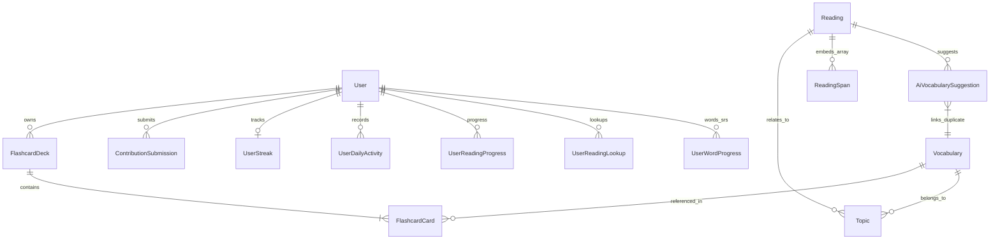

# Hagu English Project - Database Schema Overview (MongoDB / Mongoose)

Tài liệu này tổng hợp chi tiết cấu trúc cơ sở dữ liệu hiện tại của dự án **Hagu English Learning** được thiết kế bằng **Mongoose** (MongoDB).

---

## 🗺️ Sơ đồ quan hệ thực thể (Entity-Relationship Diagram - ERD)

Dưới đây là mô hình liên kết giữa các bảng (Collections) trong hệ thống:

---

## 🗄️ Danh sách các bảng (Collections)

### 1. [UserModel](file:///d:/code/Englist_project/backend/src/infrastructure/database/mongoose/models/UserModel.ts) (Người dùng)
* **Model**: `UserModel`
* **Mô tả**: Lưu trữ tài khoản người dùng, phân quyền (user, contributor, admin) và trạng thái tài khoản.
* **Cấu trúc**:
  | Trường | Kiểu dữ liệu | Bắt buộc | Chi tiết |
  | :--- | :--- | :---: | :--- |
  | `googleId` | String | Không | ID tài khoản Google (dùng cho đăng nhập bằng Google), index sparse |
  | `email` | String | Có | Email đăng nhập, duy nhất (unique), index |
  | `username` | String | Có | Tên tài khoản, duy nhất (unique), index |
  | `passwordHash`| String | Có | Mật khẩu đã được mã hóa bằng bcrypt |
  | `displayName` | String | Không | Tên hiển thị trên giao diện |
  | `avatarUrl` | String | Không | Ảnh đại diện |
  | `role` | String | Có | Phân quyền: `'user'`, `'contributor'`, `'admin'`. Mặc định: `'user'` |
  | `status` | String | Có | Trạng thái: `'active'`, `'disabled'`. Mặc định: `'active'` |
  | `lastLoginAt` | Date | Không | Lần cuối cùng đăng nhập |
  | `deletedAt` | Date | Không | Đánh dấu xóa mềm. Mặc định: `null` |
  | `createdAt` | Date | Hệ thống | Thời gian tạo tài khoản |
  | `updatedAt` | Date | Hệ thống | Thời gian cập nhật tài khoản |

---

### 2. [VocabularyModel](file:///d:/code/Englist_project/backend/src/infrastructure/database/mongoose/models/VocabularyModel.ts) (Từ vựng)
* **Model**: `VocabularyModel`
* **Mô tả**: Kho từ vựng, cụm từ, thành ngữ hệ thống hỗ trợ. Lưu trữ các biến thể (forms) phục vụ việc phân tách bài đọc và các chủ đề liên quan.
* **Cấu trúc**:
  | Trường | Kiểu dữ liệu | Bắt buộc | Chi tiết |
  | :--- | :--- | :---: | :--- |
  | `text` | String | Có | Từ vựng/Cụm từ gốc (ví dụ: `"world"`) |
  | `normalizedText`| String | Có | Từ gốc viết thường, chuẩn hóa, index |
  | `type` | String | Có | Phân loại: `'single_word'`, `'compound_word'`, `'collocation'`, `'phrasal_verb'`, `'idiom'`, `'fixed_phrase'`, `'sentence_pattern'` |
  | `level` | String | Không | Cấp độ CEFR: `'A1'`, `'A2'`, `'B1'`, `'B2'`, `'C1'`, `'C2'` |
  | `partOfSpeech`| String | Không | Từ loại (danh từ, động từ...) |
  | `phonetic` | String | Không | Phiên âm IPA |
  | `audioUrl` | String | Không | Đường dẫn file phát âm |
  | `meanings` | Array | Không | Danh sách định nghĩa và ví dụ (xem chi tiết Subschema phía dưới) |
  | `forms` | Array | Không | Danh sách các biến thể (như từ số nhiều, chia động từ) để so khớp từ vựng |
  | `components` | Array | Không | Thành phần cấu thành (dành cho từ ghép hoặc cụm từ) |
  | `topicIds` | Array [ObjectId]| Không| Liên kết tới các chủ đề (`Topic`), tham chiếu đến `Topic` |
  | `status` | String | Có | Trạng thái duyệt: `'draft'`, `'approved'`, `'rejected'`, `'archived'`. Mặc định: `'approved'` |
  | `searchTokens` | Array [String] | Không | Các tiền tố phục vụ cho prefix search tự động |
  | `createdBy` | ObjectId | Không | Người đóng góp từ vựng, tham chiếu đến `User` |
  | `updatedBy` | ObjectId | Không | Người cập nhật từ vựng, tham chiếu đến `User` |
  | `deletedAt` | Date | Không | Xóa mềm. Mặc định: `null` |

* **Subschema: `meanings`**:
  * `meaningVi` (String, Bắt buộc): Nghĩa tiếng Việt.
  * `meaningEn` (String, Không): Nghĩa tiếng Anh.
  * `note` (String, Không): Ghi chú cách dùng.
  * `examples` (Array, Không): Danh sách câu ví dụ gồm:
    * `exampleEn` (String, Bắt buộc): Câu ví dụ tiếng Anh.
    * `exampleVi` (String, Không): Dịch nghĩa tiếng Việt.
    * `source` (String, Không): Nguồn trích dẫn ví dụ.

* **Subschema: `forms`**:
  * `formText` (String, Bắt buộc): Từ biến thể (ví dụ: `"worlds"`).
  * `normalizedFormText` (String, Bắt buộc): Biến thể đã chuẩn hóa viết thường, index.
  * `formType` (String, Không): Loại biến thể.
  * `note` (String, Không): Ghi chú.

---

### 3. [TopicModel](file:///d:/code/Englist_project/backend/src/infrastructure/database/mongoose/models/TopicModel.ts) (Chủ đề từ vựng)
* **Model**: `TopicModel`
* **Mô tả**: Lưu trữ danh mục chủ đề để nhóm từ vựng và bài đọc (ví dụ: Technology, Environment, Food...).
* **Cấu trúc**:
  | Trường | Kiểu dữ liệu | Bắt buộc | Chi tiết |
  | :--- | :--- | :---: | :--- |
  | `name` | String | Có | Tên chủ đề (ví dụ: `"Food & Security"`) |
  | `slug` | String | Có | Tên không dấu duy nhất để tạo link, duy nhất (unique), index |
  | `description` | String | Không | Mô tả ngắn về chủ đề |
  | `parentTopicId`| ObjectId | Không | Liên kết đến chủ đề cha (nếu có để phân cấp), tham chiếu đến `Topic` |
  | `createdBy` | ObjectId | Không | Người tạo, tham chiếu đến `User` |
  | `updatedBy` | ObjectId | Không | Người cập nhật, tham chiếu đến `User` |
  | `deletedAt` | Date | Không | Xóa mềm. Mặc định: `null` |

---

### 4. [ReadingModel](file:///d:/code/Englist_project/backend/src/infrastructure/database/mongoose/models/ReadingModel.ts) (Bài viết / Bài đọc)
* **Model**: `ReadingModel`
* **Mô tả**: Lưu trữ bài viết đọc hiểu. Chứa mảng các `spans` đã được bộ tách từ phân tích để hiển thị nút ấn giải nghĩa nhanh.
* **Cấu trúc**:
  | Trường | Kiểu dữ liệu | Bắt buộc | Chi tiết |
  | :--- | :--- | :---: | :--- |
  | `title` | String | Có | Tiêu đề bài viết |
  | `slug` | String | Có | Đường dẫn tĩnh bài viết, duy nhất (unique), index |
  | `subtitle` | String | Không | Mô tả ngắn / Tiêu đề phụ |
  | `content` | String | Có | Nội dung bài viết thô (raw text) |
  | `level` | String | Không | Cấp độ khó: `'A1'`, `'A2'`, `'B1'`, `'B2'`, `'C1'`, `'C2'` |
  | `topicIds` | Array [ObjectId]| Không| Các chủ đề của bài đọc, tham chiếu đến `Topic` |
  | `source` | String | Không | Nguồn bài viết |
  | `estimatedReadingTimeMinutes`| Number| Không | Thời gian đọc ước tính (phút). Mặc định: `0` |
  | `spans` | Array | Không | Danh sách các phần tử chữ (từ, dấu câu, khoảng trắng) đã được phân tích (xem chi tiết phía dưới) |
  | `vocabularyIds`| Array [ObjectId]| Không| Danh sách ID các từ vựng xuất hiện trong bài, tham chiếu đến `Vocabulary` |
  | `status` | String | Có | Trạng thái bài đọc: `'draft'`, `'published'`, `'archived'`. Mặc định: `'draft'` |
  | `aiAnalysisStatus`| String | Có | Trạng thái AI phân tích từ khó: `'not_started'`, `'processing'`, `'completed'`, `'failed'`. Mặc định: `'not_started'` |
  | `aiAnalyzedAt` | Date | Không | Thời gian AI chạy phân tích |
  | `aiAnalysisHash`| String | Không | Mã băm nội dung bài viết để kiểm tra thay đổi trước khi AI phân tích lại |
  | `aiAnalysisError`| String | Không | Nội dung lỗi nếu AI phân tích thất bại |
  | `createdBy` | ObjectId | Không | Người đăng bài, tham chiếu đến `User` |
  | `updatedBy` | ObjectId | Không | Người cập nhật, tham chiếu đến `User` |
  | `deletedAt` | Date | Không | Xóa mềm. Mặc định: `null` |

* **Subschema: `spans` (ReadingSpan)**:
  Mỗi đoạn văn trong bài đọc được tách nhỏ thành các Span để frontend dựng HTML và bắt sự kiện click:
  * `text` (String, Bắt buộc): Nội dung chữ của span (ví dụ: `"world"`, `","`, `" "`).
  * `normalizedText` (String, Không): Chữ viết thường.
  * `spanType` (String, Bắt buộc): Phân loại: `'word'`, `'punctuation'`, `'space'`, `'phrase'`, `'unknown'`.
  * `lemma` (String, Không): Từ gốc nguyên bản.
  * `vocabularyId` (ObjectId, Không): Liên kết đến ID từ vựng tương ứng (nếu có trong Dictionary), tham chiếu đến `Vocabulary`.
  * `startIndex` / `endIndex` (Number, Bắt buộc): Vị trí bắt đầu/kết thúc trong bài viết gốc.
  * `orderIndex` (Number, Bắt buộc): Số thứ tự hiển thị của span.
  * `isClickable` (Boolean, Bắt buộc): Có cho phép click tra từ hay không.

---

### 5. [AiVocabularySuggestionModel](file:///d:/code/Englist_project/backend/src/infrastructure/database/mongoose/models/AiVocabularySuggestionModel.ts) (Đề xuất từ vựng từ AI)
* **Model**: `AiVocabularySuggestionModel`
* **Mô tả**: Lưu trữ danh sách các từ khó do AI tự động phát hiện khi phân tích bài đọc. Admin sẽ duyệt danh sách này để nạp từ mới vào từ điển.
* **Cấu trúc**:
  | Trường | Kiểu dữ liệu | Bắt buộc | Chi tiết |
  | :--- | :--- | :---: | :--- |
  | `readingId` | ObjectId | Có | ID bài đọc được phân tích, tham chiếu đến `Reading` |
  | `suggestedBy` | String | Có | Nguồn đề xuất: `'ai'`. Mặc định: `'ai'` |
  | `provider` | String | Có | Nhà cung cấp AI: `'9router'` |
  | `model` | String | Có | Model AI được dùng (ví dụ: `z-ai/glm-5.2` hoặc `deepseek-v4-flash`) |
  | `text` | String | Có | Từ vựng được AI phát hiện |
  | `normalizedText`| String | Có | Từ viết thường đã chuẩn hóa, index |
  | `type` | String | Có | Phân loại từ vựng do AI dự đoán (ví dụ: `'single_word'`) |
  | `level` | String | Có | Cấp độ từ vựng do AI đánh giá (ví dụ: `'B2'`) |
  | `partOfSpeech`| String | Không | Từ loại |
  | `meaningVi` | String | Có | Nghĩa tiếng Việt do AI giải dịch |
  | `meaningEn` | String | Không | Giải nghĩa bằng tiếng Anh |
  | `forms` | Array [String] | Không | Các biến thể từ vựng do AI liệt kê |
  | `topics` | Array [String] | Không | Danh sách chủ đề gợi ý |
  | `exampleEn` | String | Không | Ví dụ câu tiếng Anh do AI đặt |
  | `exampleVi` | String | Không | Dịch nghĩa câu ví dụ |
  | `confidence` | Number | Có | Độ tin cậy của AI (0.0 đến 1.0) |
  | `duplicateStatus`| String | Có | Kiểm tra trùng lặp: `'new'`, `'exists_in_dictionary'`, `'duplicate_in_suggestions'`, `'possible_duplicate'` |
  | `duplicateVocabularyId`| ObjectId| Không| ID từ vựng trùng lặp trong hệ thống nếu có, tham chiếu đến `Vocabulary` |
  | `status` | String | Có | Trạng thái xử lý: `'pending'`, `'edited'`, `'approved'`, `'rejected'`. Mặc định: `'pending'` |
  | `reviewedBy` | ObjectId | Không | Người duyệt đề xuất, tham chiếu đến `User` |
  | `reviewedAt` | Date | Không | Ngày giờ duyệt |
  | `adminNote` | String | Không | Ghi chú của admin khi duyệt |
  | `rawAiItem` | Mixed | Không | Lưu dữ liệu JSON gốc của AI trả về |
  | `deletedAt` | Date | Không | Xóa mềm |

---

### 6. [ContributionSubmissionModel](file:///d:/code/Englist_project/backend/src/infrastructure/database/mongoose/models/ContributionSubmissionModel.ts) (Lịch sử Đóng góp)
* **Model**: `ContributionSubmissionModel`
* **Mô tả**: Quản lý quy trình gửi bài đóng góp (Từ vựng hoặc Bài viết) của người dùng hoặc contributor, đang chờ admin duyệt hoặc từ chối.
* **Cấu trúc**:
  | Trường | Kiểu dữ liệu | Bắt buộc | Chi tiết |
  | :--- | :--- | :---: | :--- |
  | `submittedBy` | ObjectId | Có | Người gửi đóng góp, tham chiếu đến `User` |
  | `type` | String | Có | Loại đóng góp: `'vocabulary'`, `'reading'`, `'reading_with_ai_vocabulary'` |
  | `action` | String | Có | Hành động: `'create'`, `'update'` |
  | `targetId` | ObjectId | Không | ID thực thực mục tiêu nếu hành động là cập nhật từ/bài đã có |
  | `status` | String | Có | Trạng thái duyệt: `'pending'`, `'approved'`, `'rejected'`, `'needs_changes'` |
  | `payloadJson` | String | Có | Dữ liệu đóng góp được mã hóa dạng JSON String (sẽ được parse ra để tạo bài khi Approve) |
  | `adminNote` | String | Không | Lời nhắn / Lý do từ chối từ Admin |
  | `reviewedBy` | ObjectId | Không | Người duyệt bài, tham chiếu đến `User` |
  | `reviewedAt` | Date | Không | Ngày giờ duyệt |
  | `deletedAt` | Date | Không | Xóa mềm |

---

### 7. [FlashcardDeckModel](file:///d:/code/Englist_project/backend/src/infrastructure/database/mongoose/models/FlashcardDeckModel.ts) (Bộ thẻ ghi nhớ / Flashcard)
* **Model**: `FlashcardDeckModel`
* **Mô tả**: Nhóm các thẻ từ vựng do người dùng tự tạo để ôn tập.
* **Cấu trúc**:
  | Trường | Kiểu dữ liệu | Bắt buộc | Chi tiết |
  | :--- | :--- | :---: | :--- |
  | `ownerId` | ObjectId | Có | Chủ sở hữu bộ thẻ, tham chiếu đến `User` |
  | `name` | String | Có | Tên bộ thẻ (ví dụ: `"Từ vựng IELTS 7.5"`) |
  | `description` | String | Không | Mô tả bộ thẻ |
  | `visibility` | String | Có | Chế độ hiển thị: `'public'`, `'private'`. Mặc định: `'private'` |
  | `status` | String | Có | Trạng thái hoạt động: `'active'`, `'archived'`. Mặc định: `'active'` |
  | `cardCount` | Number | Có | Số lượng thẻ hiện có trong bộ. Mặc định: `0` |
  | `sourceDeckId` | ObjectId | Không | ID bộ thẻ gốc nếu copy từ bộ thẻ công khai của người khác |
  | `deletedAt` | Date | Không | Xóa mềm |

---

### 8. [FlashcardCardModel](file:///d:/code/Englist_project/backend/src/infrastructure/database/mongoose/models/FlashcardCardModel.ts) (Thẻ ghi nhớ cụ thể)
* **Model**: `FlashcardCardModel`
* **Mô tả**: Thẻ từ vựng chi tiết nằm trong một Bộ thẻ. Mỗi thẻ liên kết trực tiếp với một từ vựng hệ thống.
* **Cấu trúc**:
  | Trường | Kiểu dữ liệu | Bắt buộc | Chi tiết |
  | :--- | :--- | :---: | :--- |
  | `deckId` | ObjectId | Có | ID bộ thẻ chứa thẻ này, tham chiếu đến `FlashcardDeck` |
  | `vocabularyId` | ObjectId | Có | ID từ vựng được liên kết, tham chiếu đến `Vocabulary` |
  | `front` | String | Không | Ghi đè nội dung mặt trước (mặc định hiển thị từ gốc) |
  | `back` | String | Không | Ghi đè nội dung mặt sau (mặc định hiển thị giải nghĩa) |
  | `example` | String | Không | Câu ví dụ tùy chỉnh |
  | `orderIndex` | Number | Có | Thứ tự sắp xếp trong bộ thẻ |
  | `deletedAt` | Date | Không | Xóa mềm |

---

### 9. [UserWordProgressModel](file:///d:/code/Englist_project/backend/src/infrastructure/database/mongoose/models/UserWordProgressModel.ts) (Tiến trình ôn tập SRS từ vựng)
* **Model**: `UserWordProgressModel`
* **Mô tả**: Lưu trữ trạng thái học và lịch ôn tập từ vựng của từng học viên theo thuật toán **Spaced Repetition (SRS)** (Lặp lại ngắt quãng).
* **Cấu trúc**:
  | Trường | Kiểu dữ liệu | Bắt buộc | Chi tiết |
  | :--- | :--- | :---: | :--- |
  | `userId` | ObjectId | Có | Học viên ôn tập, tham chiếu đến `User` |
  | `vocabularyId` | ObjectId | Có | Từ vựng ôn tập, tham chiếu đến `Vocabulary` |
  | `status` | String | Có | Trạng thái: `'new'`, `'saved'`, `'learning'`, `'known'`, `'difficult'`, `'ignored'`. Mặc định: `'new'` |
  | `ease` | Number | Có | Hệ số dễ học (phục vụ tính khoảng cách ngày kế tiếp). Mặc định: `2.5` |
  | `intervalDays` | Number | Có | Số ngày giãn cách cho lần ôn tập tiếp theo. Mặc định: `0` |
  | `dueAt` | Date | Không | Ngày tiếp theo cần phải ôn tập từ này (phục vụ lấy danh sách từ đến hạn) |
  | `lastReviewedAt`| Date | Không | Lần cuối cùng ôn tập từ này |
  | `reviewCount` | Number | Có | Tổng số lần đã ôn tập từ này. Mặc định: `0` |
  | `correctCount` | Number | Có | Số lần chọn đúng/nhớ từ. Mặc định: `0` |
  | `wrongCount` | Number | Có | Số lần chọn sai/quên từ. Mặc định: `0` |
  | `firstSavedAt` | Date | Không | Thời gian bấm lưu từ lần đầu tiên |
  | `markedKnownAt` | Date | Không | Thời điểm đánh dấu là đã biết |
  | `markedDifficultAt`| Date| Không | Thời điểm đánh dấu là từ khó |
  | `deletedAt` | Date | Không | Xóa mềm |

---

### 10. [UserReadingProgressModel](file:///d:/code/Englist_project/backend/src/infrastructure/database/mongoose/models/UserReadingProgressModel.ts) (Tiến trình đọc hiểu)
* **Model**: `UserReadingProgressModel`
* **Mô tả**: Lưu trữ tiến độ học viên đang đọc dở hoặc đã hoàn thành một bài đọc hiểu.
* **Cấu trúc**:
  | Trường | Kiểu dữ liệu | Bắt buộc | Chi tiết |
  | :--- | :--- | :---: | :--- |
  | `userId` | ObjectId | Có | Người đọc, tham chiếu đến `User` |
  | `readingId` | ObjectId | Có | Bài viết được đọc, tham chiếu đến `Reading` |
  | `progressPercent`| Number | Có | Phần trăm hoàn thành (0 đến 100). Mặc định: `0` |
  | `lastPositionIndex`| Number| Có | Vị trí span cuối cùng học viên đọc đến. Mặc định: `0` |
  | `startedAt` | Date | Có | Bắt đầu đọc bài |
  | `lastReadAt` | Date | Có | Lần cuối mở đọc bài viết này |
  | `completedAt` | Date | Không | Thời điểm đánh dấu hoàn thành bài đọc |
  | `lookupCount` | Number | Có | Số lượng từ đã click tra cứu trong bài viết này. Mặc định: `0` |
  | `savedCount` | Number | Có | Số lượng từ đã lưu vào bộ nhớ từ bài viết này. Mặc định: `0` |
  | `deletedAt` | Date | Không | Xóa mềm |

---

### 11. [UserReadingLookupModel](file:///d:/code/Englist_project/backend/src/infrastructure/database/mongoose/models/UserReadingLookupModel.ts) (Lịch sử tra cứu trong bài đọc)
* **Model**: `UserReadingLookupModel`
* **Mô tả**: Lưu chi tiết lịch sử học viên click tra cứu từ vựng nào trong bài viết nào (phục vụ báo cáo và gợi ý từ vựng cần học).
* **Cấu trúc**:
  | Trường | Kiểu dữ liệu | Bắt buộc | Chi tiết |
  | :--- | :--- | :---: | :--- |
  | `userId` | ObjectId | Có | Người tra từ, tham chiếu đến `User` |
  | `readingId` | ObjectId | Có | Bài viết chứa từ tra cứu, tham chiếu đến `Reading` |
  | `vocabularyId` | ObjectId | Có | ID từ vựng được tra cứu, tham chiếu đến `Vocabulary` |
  | `readingSpanId`| String | Không | Vị trí orderIndex hoặc ID của Span được click |
  | `lookupText` | String | Không | Đoạn chữ thực tế người dùng click tra |
  | `lookedUpAt` | Date | Có | Ngày giờ tra cứu. Mặc định: `Date.now` |
  | `deletedAt` | Date | Không | Xóa mềm |

---

### 12. [UserStreakModel](file:///d:/code/Englist_project/backend/src/infrastructure/database/mongoose/models/UserStreakModel.ts) (Theo dõi Chuỗi ngày học liên tục)
* **Model**: `UserStreakModel`
* **Mô tả**: Quản lý chuỗi ngày hoạt động liên tục (Streak) của người dùng nhằm tăng tính tương tác (Gamification).
* **Cấu trúc**:
  | Trường | Kiểu dữ liệu | Bắt buộc | Chi tiết |
  | :--- | :--- | :---: | :--- |
  | `userId` | ObjectId | Có | Người dùng, duy nhất (unique), index, tham chiếu đến `User` |
  | `currentStreak`| Number | Có | Chuỗi ngày liên tiếp hiện tại. Mặc định: `0` |
  | `bestStreak` | Number | Có | Chuỗi ngày liên tiếp kỷ lục lớn nhất. Mặc định: `0` |
  | `lastActiveDate`| String | Có | Ngày hoạt động gần nhất dạng chuỗi: `YYYY-MM-DD` |
  | `streakUpdatedAt`| Date | Có | Thời gian hệ thống cập nhật streak gần nhất. Mặc định: `Date.now` |

---

### 13. [UserDailyActivityModel](file:///d:/code/Englist_project/backend/src/infrastructure/database/mongoose/models/UserDailyActivityModel.ts) (Nhật ký hoạt động hàng ngày)
* **Model**: `UserDailyActivityModel`
* **Mô tả**: Thống kê số lượng hoạt động của người dùng trong một ngày (ví dụ: học từ, đọc bài, tạo bộ thẻ...).
* **Cấu trúc**:
  | Trường | Kiểu dữ liệu | Bắt buộc | Chi tiết |
  | :--- | :--- | :---: | :--- |
  | `userId` | ObjectId | Có | Người dùng hoạt động, tham chiếu đến `User` |
  | `date` | String | Có | Ngày hoạt động dạng: `YYYY-MM-DD` |
  | `activityTypes` | Array [String]| Không| Các loại hành vi được ghi nhận (ví dụ: `['lookup', 'streak_update']`) |
  | `activityCount` | Number | Có | Tổng số hành vi được ghi nhận trong ngày. Mặc định: `0` |
  | `firstActivityAt`| Date | Có | Thời điểm bắt đầu hoạt động đầu tiên của ngày |
  | `lastActivityAt`| Date | Có | Thời điểm hoạt động cuối cùng được ghi nhận trong ngày |
